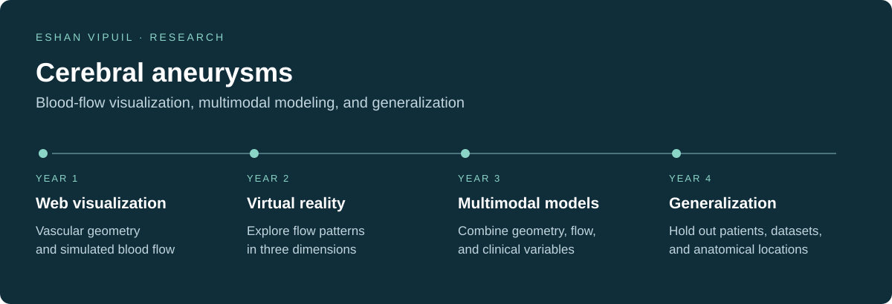

# Eshan Vipuil

I'm a student at West Shore Junior/Senior High School interested in computational modeling, machine learning, and biomechanics. My research began with a question: how can we make blood flow in a cerebral aneurysm easier to see and study?

I first built a web application to visualize computational fluid dynamics results, then extended that work into virtual reality. My third year focused on aneurysm detection, physics-informed flow modeling, and rupture classification. My current work examines how these models generalize across patients, datasets, and anatomical locations.

## Research

| Project | My work | Paper |
| --- | --- | --- |
| [Year 4: Generalization and hemodynamics](https://github.com/evipuil/Cerebral-Aneurysm-Modeling-ResearchY4) | Compare patient-grouped, dataset-held-out, and location-held-out validation, with physics guidance and FEM pretraining. | [Year 4 report](papers/year4-research-report.pdf) |
| [Year 3: Aneurysm rupture modeling](https://github.com/evipuil/Aneurysm-Rupture-Risk-Prediction-ResearchY3) | Developed and compared models that combine geometry, flow measurements, and clinical variables, with a common training and evaluation procedure. | [2025–26 PDF](papers/science-research-2025-26.pdf) |
| [HemoViz3D VR](https://github.com/evipuil/HemoViz3D-VR-App-ResearchY2) | Built a Unity/C# environment for exploring CFD-derived blood flow in 3D, including color mapping and animation. | [2024–25 PDF](papers/science-research-2024-25.pdf) |
| [HemoViz3D Web](https://github.com/evipuil/HemoViz3D-Web-App-ResearchY1) | Built a Flask application that combines vascular geometry with velocity and wall shear stress plots and time-varying visualizations. | [2023–24 PDF](papers/science-research-2023-24.pdf) |

**Publication:** [HemoViz3D: A Novel Open-Source Web Application for Visualization of Blood Flow Dynamics in Cerebral Aneurysms](https://doi.org/10.36838/v7i5.27), *International Journal of High School Research* (2025).

**Preprint:** Eshan Vipuil and Xianqi Li. [Integrating Physics-Informed Neural Networks and 3D Vascular Geometry Learning for Cerebral Aneurysm Detection and Multimodal Rupture-Risk Prediction](https://arxiv.org/abs/2607.10530). arXiv, July 2026. [Read the PDF](https://arxiv.org/pdf/2607.10530).

## School and community

- [Quiz Arena](https://github.com/evipuil/Quiz-Arena): solo practice and local head-to-head buzzer matches for academic team practice.
- [The Lagoon Legacy Project](https://github.com/evipuil/TheLagoonLegacyProject-Website): a website for environmental education, county chapters, and community participation around the Indian River Lagoon.
